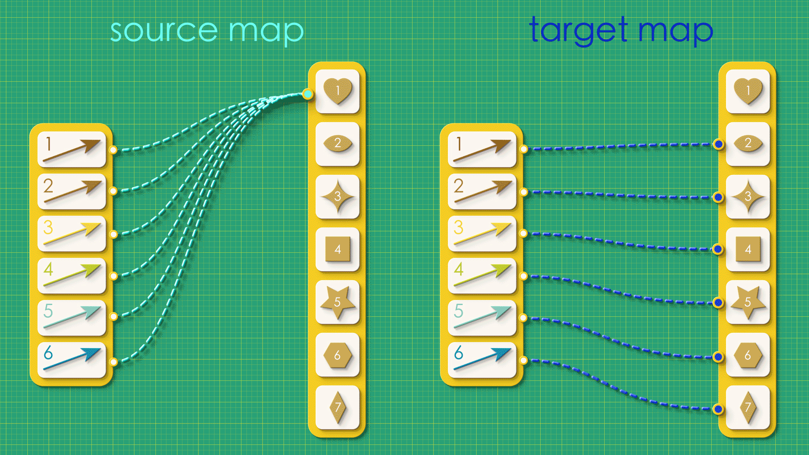
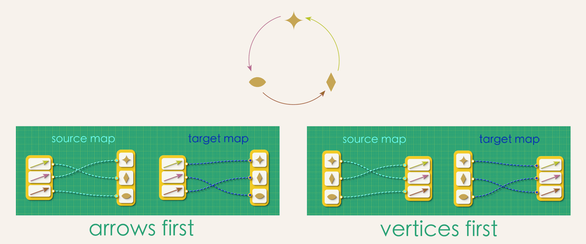

---
jupytext:
  formats: md:myst
  text_representation:
    extension: .md
    format_name: myst
kernelspec:
  display_name: Julia 1.10
  language: julia
  name: julia-1.10
---

# Chapter 1: Data

> The logjam you don’t even know you’re stuck in will be broken by a shift in representation.
>
>Michael Sorkin
>
>*Two Hundred Fifty Things an Architect Should Know*


## 1.1 Introduction

Reread the description from the mythological romance in the last chapter:

:::{admonition} Mythological Romance:
**Aphrodite loves Adonis and Adonis loves Aphrodite. But Adonis is polyamorous and is also in love with Narcissus. And Narcissus, of course, loves only himself.**
:::

Now, expand the panel below to see the directed graph that goes with this description.

:::{admonition} Directed Graph
:class: dropdown


:::


Note how the written description required concentration and parsing to understand. But the associated graph made all the essential information instantly available. Humans are visual creatures, and directed graphs leverage our visual perception and spatial thinking to lay out all of the pertinent details in a single view.

When we look at a directed graph we can instantly see many relationships: *this* arrow is connected to *these* vertices, *this* vertex has no arrows, etc. Such relationships are implicit, made apparent to us by the visual proximity of the graph elements. But unlike humans, computers are *not* visual creatures. If we want to involve the computer in our thinking we need to find another (non-visual!) way of communicating these relationships. The following video outlines one possible approach to redescribing our graph in a way that a computer can understand.

## 1.2 Source and Target Maps

<center style="width: 100%; aspect-ratio: 16/9;"> <iframe width="100%" height="100%" src="https://www.youtube-nocookie.com/embed/QfvtWgopGiY?si=JoJJP7jhe3-QoxEN" title="YouTube video player" frameborder="0" allow="accelerometer; autoplay; clipboard-write; encrypted-media; gyroscope; picture-in-picture; web-share" referrerpolicy="strict-origin-when-cross-origin" allowfullscreen></iframe> </center>

The virtue of making these relationships explicit is that the information can now be written in list form, and lists are a data structure that can be easily typed into a computer.


> DISCLAIMER: In our code samples we will be working with a graphics visualization tool called Graphviz. This is a convenient visualization package for our “under development” software, but it can sometimes behave like an inept reconstructor. Don’t be surprised if, along the way, Graphviz gives you some puzzling representational choices!

### Puzzles

::::{admonition} Puzzle 1

1. Get out a pencil and paper and see if you can draw the directed graphs described by these source and target maps

a.


b.


::::

::::{admonition} Puzzle 2

2. Examine the following directed graphs and see if you can draw their source and target maps.


::::

::::{admonition} Puzzle 3

3. Take your source and target maps from the last problem and convert them into lists of numbers.

::::

:::: {admonition} Puzzle 4

4. Take your lists of numbers from the last problem and enter them into the code below, replacing the '?'s under "src" and "tgt". Hit "run". Do the graphs look the way you expected?

::::

+++

```{code-cell}
using Catlab.CategoricalAlgebra, Catlab.Graphs, Catlab.Graphics

AJ_Problem4a = Graph()
add_vertices!(AJ_Problem4a,2)
add_parts!(AJ_Problem4a, :E, 2, src=[?,?], tgt=[?,?])
to_graphviz(AJ_Problem4a)
```

+++


+++

```{code-cell}
AJ_Problem4b = Graph()
add_vertices!(AJ_Problem4b,6)
add_parts!(AJ_Problem4b, :E, 3, src=[?,?,?], tgt=[?,?,?])
to_graphviz(AJ_Problem4b)
```

+++


## 1.3 On the importance of finding the right abstractions 

We've come up with one way to describe a directed graph to a computer. But is it the best way? Are there other approaches we should consider?

In our current approach each arrow gets assigned a unique source vertex and a unique target vertex. What would happen if we flip the direction of that assignment? That is, instead of the assignment starting from the arrows, we instead start from vertices, assigning each vertex as a source or target to the arrows.


*What does it mean when connections flow in opposite directions?*

Is there a difference between “arrows-first” and “vertices-first” representations?


At first glance, these might seem like the exact same thing. But in fact, a whole bunch of *problems* arise if we try to think about directed graphs in the second way! 


First of all, there are many directed graphs that can't be expressed this way at all - at least not without relaxing some of our rules for making source and target maps.

```{image} assets/Ch1/Branchy.gif
:alt: Whoopsy!
:width: 500px
:align: center
```


In the above graph, some vertices need to map to *many* arrows while others don't map to any. So instead of the simplicity we had in the arrows-first approach (where each arrow had *one-and-only-one source vertex* and *one-and-only one target vertex*) we now must allow for arbitrary of branching in our maps. This looser specification gives rise to a number of bookkeeping headaches. For example, how you would express the above map to a computer? Lists won't do it anymore. It turns our you'll now have to enter *lists of lists!*  


But more importantly, the vertex-first approach makes us vulnerable to the `DANGLING EDGE CONDITION`.


Suppose we created a random graph using the vertices-first approach, just throwing together source and target maps, arbitrarily connecting things without giving any thought to what the resulting graph will be like.

*"Random" source and target maps*

In this case, when we try reconstruct the graph from this random data, we get a mutant!

```{image} assets/Ch1/MutantGraph.jpg
:alt: Whoopsy!
:width: 500px
:align: center
```

Dangling arrows, arrows that have to come out of multiple vertices somehow, arrows floating off by themselves unattached to anything. It's carnage! By designing our maps in the vertices-first approach we open up the possibility of creating *nonsense*: maps which may appear valid at first, but which produce broken directed graphs when we try to interpret them. By contrast, any maps in the arrows-first approach can't help but be proper directed graphs.


Our purpose in comparing these approaches is to highlight the difference between “good” and “bad” representations. It's hard to escape the feeling that the arrows-first approach is somehow the natural way to describe directed graphs. There is an *exact* correspondence between what we're interested in (directed graphs!) and what the maps are capable of expressing. By contrast, the vertices-first approach produces the typical problems of “bad” representations, which force you to countenance nonsense and deal with problematic edge cases. In a word, they're *fussy*. And this kind of fussiness is not just annoying, it turns out to be a barrier to abstraction. 

As we go through this book we will take a series of increasingly abstract points of view on graphs. The beauty of beginning this journey with a good representation is that it permits us to move up the ladder of abstractions cleanly, at each stage fully disregarding the details of the previous level and being able to take for granted that everything below our current view will naturally take care of itself.

## 1.4 Summary
In this chapter we have moved up our first rung on this ladder of abstractions - from directed graphs themselves to the graph _data_. In the coming chapters we will continue to climb, moving on to “Blueprints” in Chapter 3 and “Categories” in Chapter 4. At each step, we will obtain new capabilities and new ways of thinking about structures and modeling. But as we will see, we're only able to reap the cumulative benefits of abstraction because we're choosing the more elegant representation at the start.


