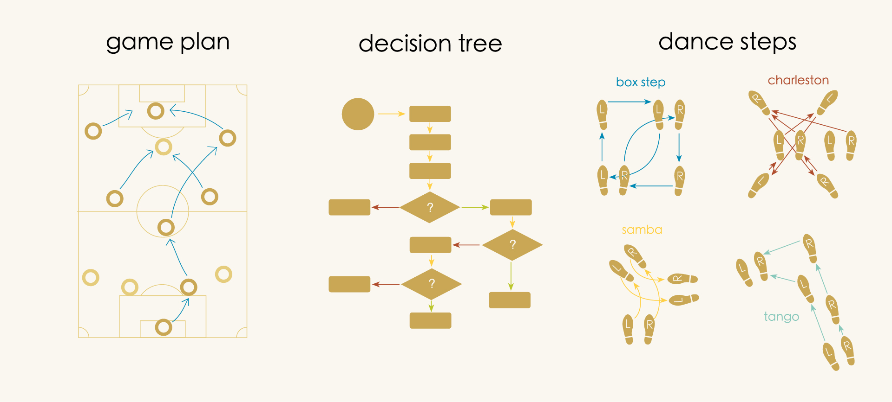
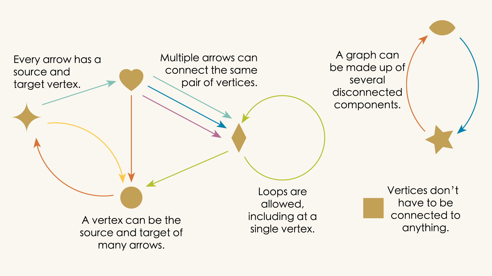
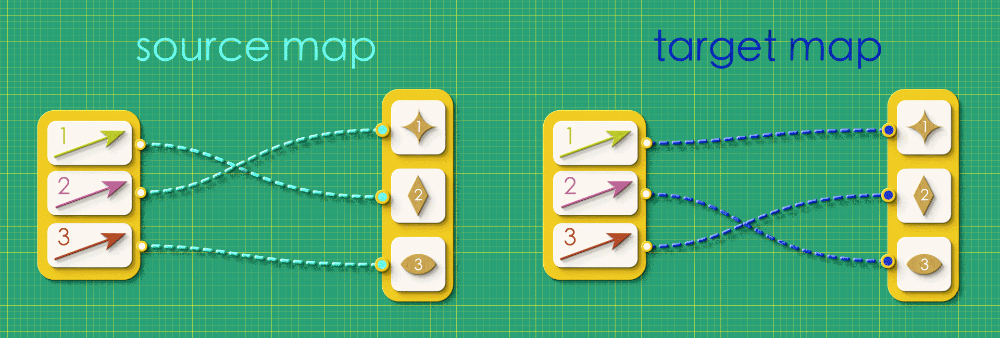
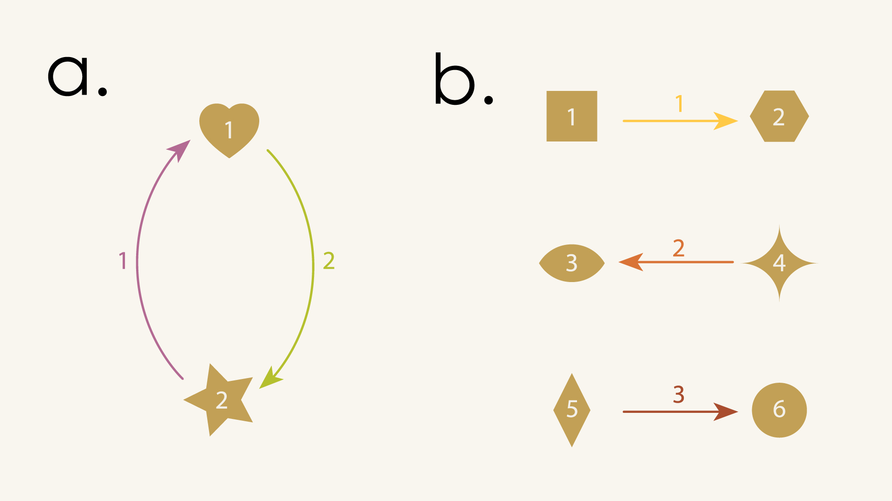
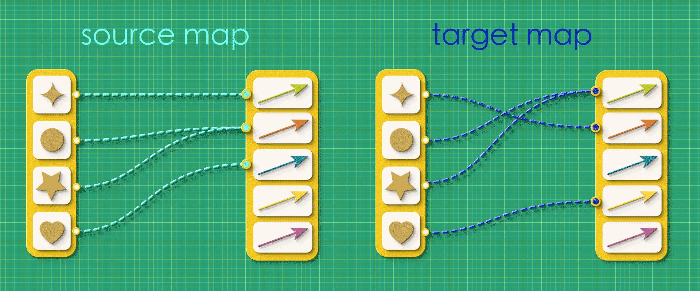
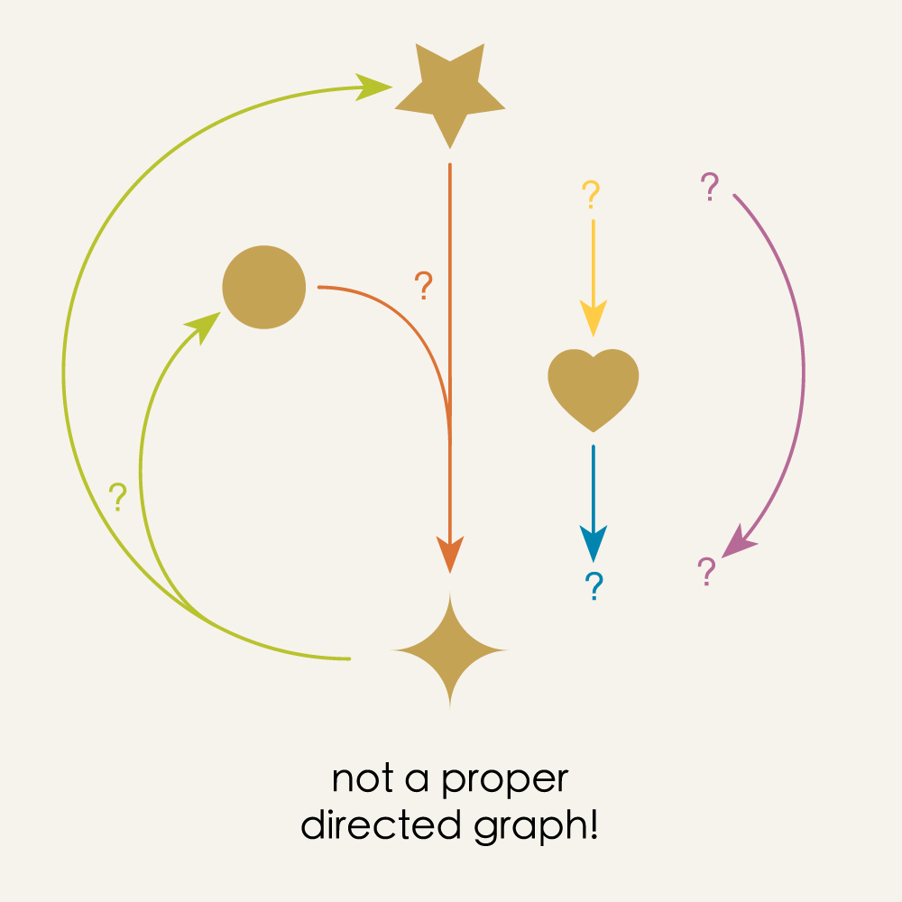
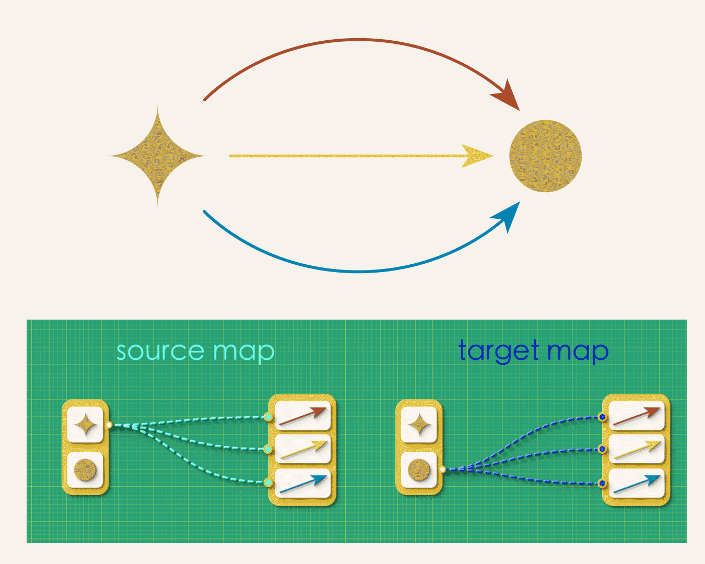
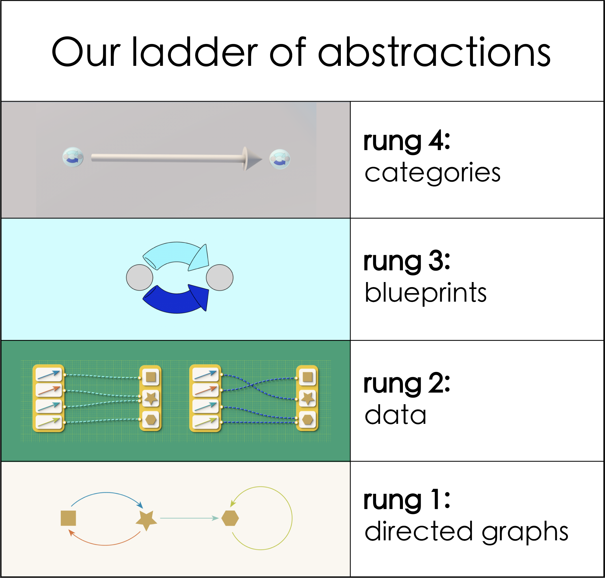

---
jupytext:
  formats: md:myst
  text_representation:
    extension: .md
    format_name: myst
kernelspec:
  display_name: Julia 1.10
  language: julia
  name: julia-1.10
---

# Chapter 1: Directed Graphs

> The logjam you don’t even know you’re stuck in will be broken by a shift in representation.
>
>Michael Sorkin
>
>*Two Hundred Fifty Things an Architect Should Know*

## Part 1: Modeling with directed graphs

We will begin our journey into systems thinking and Algebraic Julia by looking at a particularly simple modeling system called a *directed graph*. Anyone who's ever used a flow chart, studied a subway map, or learned the Charleston will have encountered the basic idea.

What do these diagrams all have in common? First, they all have arrows. Second, they all have some “points” (players, footprints, questions, etc.), and every arrow connects one point to some other point. More formally these points are usually known as "vertices" (”vertex” when singular), and the official rules for directed graphs are: 

It's a simple setup but many situations in life - many *systems* - are well-captured by this kind of diagram.

Consider how we can use directed graphs to represent the following three situations:
### 1. MYTHOLOGICAL ROMANCE: ###

**Aphrodite loves Adonis and Adonis loves Aphrodite. But Adonis is polyamorous and is also in love with Narcissus. And Narcissus, of course, loves only himself.**

We can make a directed graph of these relationships in which the vertices are characters and an arrow indicates that the person at the source loves the person at the target.

### 2. SKI TRIP BROCHURE: ###

**From our ski lodge, you can take the lift to the top of the mountain. Skiing down the slope will take you to an isolated Alpine village in a valley where you can cross-country ski around the surrounding landscape. Of course, some people don't know how to ski. If that sounds like you, don't worry! You can still visit the mountain top to see the beautiful view and then just jump back on the lift and return to the lodge.**

In this directed graph, the vertices are locations and the arrows are "modes of transport" from one location to another.

If you squint, you can look at this like a simplified map. We've left out the trees and the geography and the distances from one place to another. We've distilled our wayfinding to only the most essential details needed for getting around.

### 3. WHOSE TURN IS IT TO DO THE DISHES? ###

**My wife and I used to trade off doing the dishes each day. Then our friend Tuco moved in who loves doing dishes and he has done them ever since. I think my wife was the last one to do the dishes before Tuco took over.**

In this directed graph, the vertices are once again people and each arrow connects two people who may do dishes on consecutive days.

Looked at individually each of the above situations seem quite different. But their directed graphs make it clear that they all share the same essential structure. Abstractly, they are all the same graph, which we can represent in unlabeled form:

When used casually like this, directed graphs are little more than convenient pictures–visual heuristics that make it easier to think about the underlying situations. These simple examples may not seem to require any mathematical considerations or computational aid. But we will come to see that if we represent these structures formally in a computer a surprising array of computational powers become available to us.

## Part 2: Directed graphs with a computer ##

Note how, in the examples above, the written description of each situation required some concentration and parsing to understand. But the associated graph made all the essential information instantly available. Humans are visual creatures, and directed graphs leverage our visual perception and spatial thinking to lay out all of the pertinent details in a single view.

When we look at a directed graph we can instantly see many relationships: *this* arrow is connected to *these* vertices, *this* vertex has no arrows, etc. Such relationships are implicit, made apparent to us by the visual proximity of the graph elements. But unlike humans, computers are *not* visual creatures. If we want to involve the computer in our thinking we need to find another (non-visual!) way of communicating these relationships. The following video outlines one possible approach to redescribing our graph in a way the computer can understand.

PLACEHOLDER FOR VIDEO

The virtue of making these relationships explicit is that the information can now be written in list form, and lists are a data structure that can be easily typed into a computer.

> DISCLAIMER: In our code samples we will be working with a graphics visualization tool called Graphviz. This is a convenient visualization package for our “under development” software, but it can sometimes behave like an inept reconstructor. Don’t be surprised if, along the way, Graphviz gives you some puzzling representational choices!

### Problems ###

1. Get out a pencil and paper and see if you can draw the directed graphs described by these source and target maps

a.

b.

2. Examine the following directed graphs and see if you can draw their source and target maps.

3. Take your source and target maps from the last problem and convert them into lists of numbers.

4. Take your lists of numbers from the last problem and enter them into the code below and hit Run. Do the graphs look the way you expected?

## Part 3: On the importance of finding the right abstractions ##

We've come up with one way to describe a directed graph to a computer. But is it the best way? Are there other approaches we should consider?

Under our current method each arrow is assigned a unique source vertex and a unique target vertex. What would happen if we flip the direction of the assignment? That is, instead of the assignment starting from arrow, we can instead start from vertices, and assign to each vertex a source arrow and/or a target arrow.

*What does it mean when connections flow in opposite directions?*

Is there a difference between “arrows-first” and “vertices-first” representations?

At first glance, these might seem like the exact same thing. But in fact, a whole bunch of *problems* arise if we try to think about directed graphs in the second way! 

Two lovely features of our former “arrows-first” approach were:

- Every source and target map corresponded to *some* directed graph.
- E*very* directed graph can be expressed this way.

Neither of these things is true with the “vertices-first” approach.

Suppose we created a random graph using the vertices-first approach, just throwing together source and target maps, arbitrarily connecting things without giving any thought to what the resulting graph will be like.

*"Random" source and target maps*

In this case, when we try reconstruct the graph from this random data, we get a mutant!

Dangling arrows, arrows that have to come out of multiple vertices somehow, arrows floating off by themselves unattached to anything. It's carnage! By designing our maps in the vertices-first approach we open up the possibility of creating *nonsense*: maps which may appear valid at first, but which produce broken directed graphs when we try to interpret them.

To make matters worse, there are many directed graphs that can't be expressed this way at all - at least not without relaxing some of our rules for making source and target maps.

In the above graph, some vertices need to map to *many* arrows while others don't map to any. So instead of the simplicity we had in the arrows-first approach–with each arrow having *one-and-only-one source vertex* and *one-and-only one target vertex*–we now must allow for arbitrary of branching in our maps. This looser specification gives rise to a number of bookkeeping headaches. For example, how you would express the above map to a computer? List won't do it anymore. It turns our you'll now have to enter *lists of lists!*  

Our purpose in comparing these approaches is to highlight the difference between “good” and “bad” representations. It's hard to escape the feeling that the arrows-first approach is somehow the natural way to describe directed graphs. There is an *exact* correspondence between what we're interested in (directed graphs!) and what the maps are capable of expressing. By contrast, the vertices-first approach produces the typical problems of “bad” representations, which force you to countenance nonsense and deal with problematic edge cases. In a word, they're *fussy*. And this kind of fussiness is not just annoying, it turns out to be a barrier to abstraction. 

As we go through this book we will take a series of increasingly abstract points of view on graphs. The beauty of beginning this journey with a good representation is that it permits us to move up the ladder of abstractions cleanly, at each stage fully disregarding the details of the previous level and being able to take for granted that everything below our current view will naturally take care of itself.

In this chapter we have moved up our first rung on this ladder of abstractions - from directed graphs to source and target maps. In the coming sections we will continue to climb, moving on to “Schemas” in section 2 and “Categories” in section 3. At each step, we will obtain new capabilities and new ways of thinking about structures and modeling. But as we will see, we're only able to reap the cumulative benefits of abstraction because we're choosing the more elegant representation at the start.

